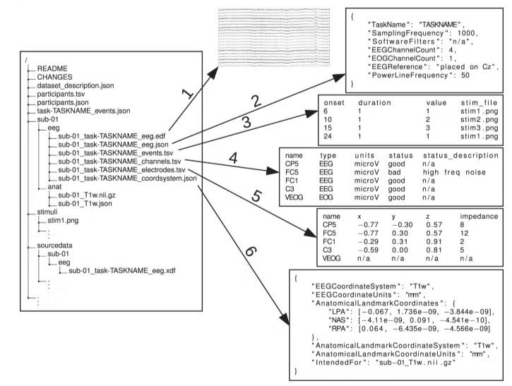

The EEG along with its accompanying meta data has been used to structure the data in BIDS () format. The structuring applied is based on that described in Pernet et al (2019) and summarized in figure 1. 

The structuring of the data in BIDS is carried out by the matlab function:

CLV_createBIDS(). Below is a link to the function on Github.

