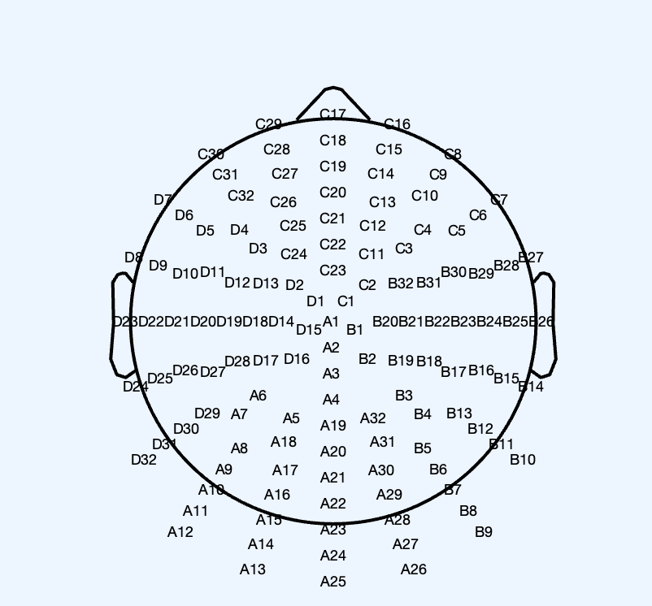

The channel coordinates are provided by 4 coordinates files; each coordinates file corresponds to a specific cap size. The four coordinates files are the following:

- Biosemi_128_Taille_Large.mat
- Biosemi_128_Taille_XLarge.mat
- Biosemi_128_Taille_Medium.mat
- Biosemi_128_Taille_MLarge.mat
- Biosemi_128_Taille_Small.mat

For each participant, the cap size is extracted from “**participants.csv**” file and, based on this, the corresponding coordinates *.mat file is automatically applied. The coordinates in the *.mat file is added to **EEG.chanlocs** structure of the participant’s EEG structure.

