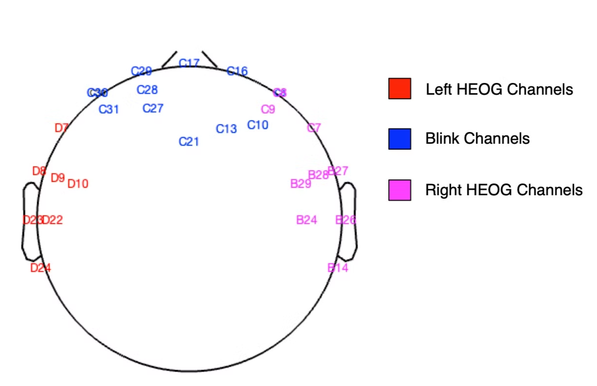

This method creates a mask that specifies the localisation of eye-blinks in the continuous EEG by using an inter-quartile range threshold. 

<aside>
❗

This method is applied in the second round of Multi-channel Wiener Filtering (MWF) and so, if at least the first and second rounds of MWF are being carried out, it is not necessary to carry out this step here.

</aside>

In the RELAX config, the user specifies the probability that data does not have blinks as follows:

- 0 $\implies$data almost certainly has blinks
- 1 $\implies$data might not have blinks
- 2 $\implies$data definitely does not have blinks

As data entered into the pipeline is resting-state data and the participants should have had their eyes closed during EEG acquisition, we specify the probability as 1, the data might not have blinks. For probabilities of 0 or 1, the IQR method is applied to detect and mark eye-blinks. 

To facilitate blink detection using this method, channels most likely to present blink artifacts are defined in the RELAX config. The following are the channels defined:

- RELAX_cfg.BlinkElectrodes = C29, C17, C16, C30, C8, C27, C21, C13, C10
- RELAX_cfg.HEOGLeftpattern = C30, D7, D8, D9, D23, D10, D22, D24, C31
- RELAX_cfg.HEOGRightpattern = C8, C7, B27, B28, B26, B29, B24, B14, C9

The positions of each of these channels are indicated in the following figure.

