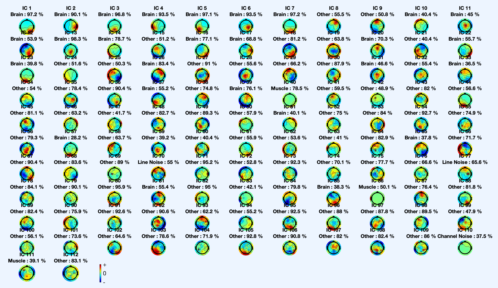

The computed ICs (Independent Components) are automatically classified using EEGLAB’s ICLabel plugin. The algorithms underlying the automatic classification of ICs is based on crowd sourcing run by the Swartz Center for Computational Neuroscience, University of California, which involves experts contributing to the ICLabel project by volunteering to label components. The ICLabel plugin automatically classifies ICs into broad categories based on their source:

- Brain
- Muscle
- Ocular
- Cardiac
- Channel noise
- Line noise
- Other

In the current implementation, an IC is considered for rejection if the probability of it corresponding to Muscle, Ocular, Cardiac, Channel or Line noise is equal to or above 80%. 
```matlab
% IC classes: Brain, Muscle, Eye, Heart, LineNoise, ChannelNoise, Other
 icThreshold    = [0 0.0; 0.8 1; 0.8 1; 0.8 1; 0.8 1; 0.8 1; 0 0];
```



## Wavelet thresholding of classified ICs

This technique, known as wavelet-enhanced ICA (wICA) makes use of wavelet thresholding which can conserve the tempero-spectral structure the artifacts thus allowing the brain activity that leaked into the ICs to be recovered. This implies that the wavelet technique is used to enhance the performance of the ICA artifact suppression and avoid the danger of suppressing brain activity when rejecting ICs.

In the RELAX pipeline wavelet thresholding is carried out only on those ICs detected as artifacts and marked for rejection after classification by the ICLabel plugin. 

