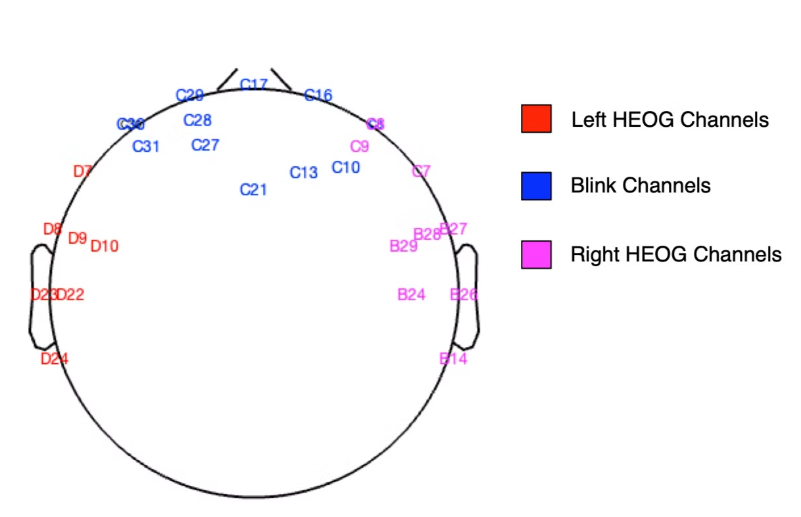

In this second round of MWF, blinks are mainly dealt with. However, it is also possible to detect eye-blinks in the first round, in which case the eye-blink mask will be integrated into the noise mask. To allow eye-blink cleaning in round 1:

- **RELAX_cfg.MWFRoundToCleanBlinks** = 1

As explained for the blink detection via IQR step, in the second round of MWF, the user needs to define the probability that the current data contains blink artifacts. The choices are:

- data almost certainly has blinks: **RELAX_cfg.ProbabilityDataHasNoBlinks** = 0
- data might not have blinks : **RELAX_cfg.ProbabilityDataHasNoBlinks** = 1
- data definitely does not have blinks: **RELAX_cfg.ProbabilityDataHasNoBlinks** = 2

In GUI: Does the data contain blinks? : **RELAX_cfg.ProbabilityDataHasNoBlinks** = 0.

The aim is to detect eye-blinks that were masked my muscle activity and, thus, missed in round one of MWF.

To detect eye-blinks, a copy of data was bandpass filtered using a 4th order Butterworth filter between 1-25Hz. Data in channels identified as blink-relevant was averaged. And blinks were marked as the maximum point within each time-period that exceeded the value of the upper quartile of all voltages + the interquartile range (IQR)*3. 

This is carried out by the function in the following code if it is specified that the probability that the dataset does not have blinks is 0. 

```matlab
[continuousEEG, epochedEEG] = RELAX_blinks_IQR_method(continuousEEG, epochedEEG, RELAX_cfg)
```

Thus, a blink mask was created for MWF cleaning by marking the 800ms surrounding all blink maximums as artifacts. 

### *Define blink-relevant channels*

- In GUI: Blink affected electrodes: **RELAX_cfg.BlinkElectrodes** = C29, C17, C16, C30, C8, C28, C27, C21, C13, C10.
- In GUI: Left sided HEOG affected electrodes: **RELAX_cfg.HEOGLeftpattern** = C30, D7, C8, D9, D23, D10, D22, D24, C31.
- In GUI: Right sided HEOG affected electrodes: **RELAX_cfg.HEOGRightpattern** = C8, C7, B27, B28, B26, B29, B24, B14, C9.

The spatial localisation of the defined blink-relevant channels are indicated in the figure below.


