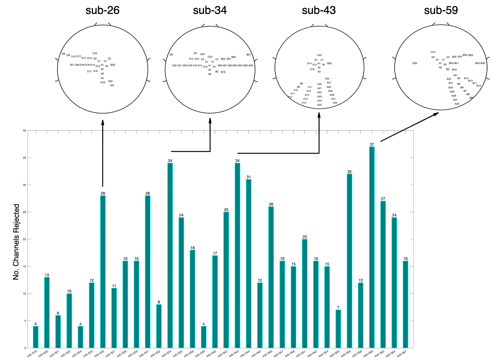

The following figures present a summary of the number and spatial location of the channels rejected, per participant, during the preprocessing carried out by the RELAX pipeline as well as the total time (in seconds) rejected per participant. 

 per participant for 11 participants (**Posttest Restingstate1**). The total rejected time for each participant is presented above each bar. This corresponds to the data rejected during the pre-MWF extreme data rejection. ")

.jpg "Figure 3: An overview of the number of channels rejected per participant for **Posttest Restingstate2**. For those participants with a high number of rejected channels, a topography presents the localisation of those channels rejected.")

 per participant for 11 participants (**Posttest Restingstate2**). The total rejected time for each participant is presented above each bar. This corresponds to the data rejected during the pre-MWF extreme data rejection. ")