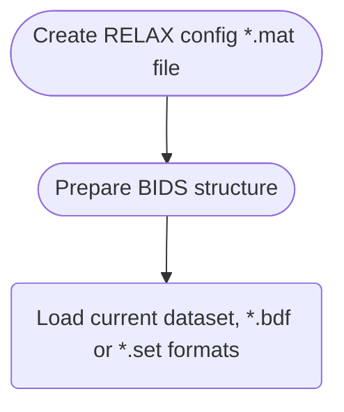

Overview of resting-state EEG processing and analysis carried out in the context of the Celavie project.

<!--more-->

**Flowchart of RELAX pipeline applied to resting-state hdEEG data**

```mermaid
flowchart TD;

Config([Create RELAX config *.mat file]) --> BIDS([Prepare BIDS structure]);
BIDS --> Ld(Load current dataset, *.bdf or *.set formats);

```