```mermaid

flowchart TD;

Config([Create RELAX config *.mat file]) --> BIDS([Prepare BIDS structure]);
BIDS --> Ld(Load current dataset, *.bdf or *.set formats);
Ld --> EXRej([Exclude external channels]);
EXRej --> AddRS(Calculate and add downsampling info to RELAX config);
AddRS --> AddChan(Add channel coordinate information to EEG structure);
AddChan --> ScalpRej([Delete scalp channels marked for rejection]);
ScalpRej --> Notch([Apply notch filter, 4th order Butterworth: 47Hz - 53Hz]);
Notch --> HPfilt([Apply high-pass filter, 4th order Butterworth : 0.25Hz]);
HPfilt --> RSamp([Downsample the data]);
RSamp -->|Plot Channel Spectra|Prep([Detect noisy channels: PREP pipeline function]);
Prep --> EpClean([Epoch data to detect extremely noisy time periods: 1second epochs]);
EpClean --> XtremeData([Delete channels exceeding threshold of proportion of data with extreme outliers: max. of 20% channels]);
XtremeData --> Blink([Eye-blink detection via IQR approach]);
Blink -->|Record artifact rejection details|SerArrChoice{Multi Wiener Filtering or MWF?};
SerArrChoice -->|No|DoSerArr([Calculate Signal-to-error Ratio and Artifact-to-residue ratio]);
SerArrChoice -->|Yes| MWF1([Carry out MWF Round 1: Detect and clean muscle artifacts]);
MWF1 -->|Record processing stats for MWF 1 in RELAX config| MWF2([Carry out MWF Round 2: Detect eye-blinks masked by muscle artifacts]);
MWF2 --> |Record processing stats for MWF 2 in RELAX config| MWF3([Carry out MWF Round 3: Detect drift-related and hEOG artifacts]);
DoSerArr --> Reref([Perform robust average re-referencing]);
MWF3 -->|Record processing stats for MWF 3 in RELAX config| Reref;
Reref --> Nanrej([Reject data periods marked as NaN in noise masks]);
Nanrej --> ICAInfomax([Perform ICA using the Infomax algorithm]);
ICAInfomax --> wICA([Perform wavelet-enhanced ICA on artifact-related ICs detected by ICLabel function]);
wICA --> CCM([Compute cleaned metrics]);
CCM -->|Record warnings about potential issues in RELAX config|Interp([Interpolate rejected channels using Spherical Spline Interpolation]);

```

<!--more-->

## RELAX pipeline data flowchart

Below is a data flowchart showing the principle steps applied in the implementation of the RELAX pipeline used to preprocess the hdEEG resting-state data.
You can access the details of each stage of the data flowchart via [this page...]()
